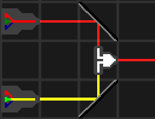

# Description
Adds extra components to ChromaBeam.

# List of components

## XOR gate
This gates output is the bitwise XOR of the gates 2 inputs.

## AND gate
This gates output is the bitwise AND of the gates 2 inputs.

